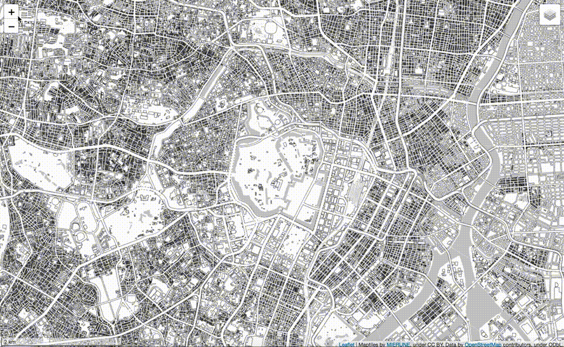

# leaflet-starter


Start Leaflet easily.  
- [Leaflet v1.7.1](http://leafletjs.com) 
- [webpack v5.38.1](https://webpack.js.org)  
- node v16.3.0
- npm v7.15.1

<br>

## Usage


<br>

Install package
```bash
npm install
```

<br>

build
```bash
npm run build
```

<br>

dev
```bash
npm run dev
```

---

<br>
<br>



<br>

## License
MIT

Copyright (c) 2018-2021 Yasunori Kirimoto

<br>

---

<br>

### Japanese

<br>

# Leaflet スターター


Leafletを手軽に始める
- [Leaflet v1.7.1](http://leafletjs.com) 
- [webpack v5.38.1](https://webpack.js.org)  
- node v16.3.0
- npm v7.15.1

<br>

##  使用方法


<br>

パッケージインストール

```bash
npm install
```

<br>

ビルド

```bash
npm run build
```

<br>

開発

```bash
npm run dev
```

<br>
<br>


<br>

## ライセンス
MIT

Copyright (c) 2018-2021 Yasunori Kirimoto

<br>
