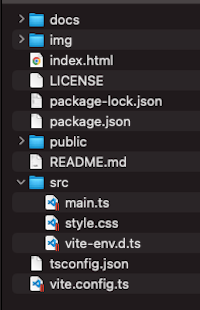

# leaflet-starter


Start Leaflet easily.  
- [Leaflet](http://leafletjs.com) 
- [webpack](https://webpack.js.org)  

<br>

## Usage


<br>

Install package

```

npm install

```

<br>

build

```

npm run build

```

<br>

dev

```

npm run dev

```

---

<br>
<br>


<br>

## License
MIT

Copyright (c) 2017 Yasunori Kirimoto

<br>

---

<br>

### Japanese

<br>

# Leaflet スターター


Leafletを手軽に始める
- [Leaflet](http://leafletjs.com) 
- [webpack](https://webpack.js.org) 

<br>

##  使用方法



<br>

パッケージインストール

```

npm install

```

<br>

ビルド

```

npm run build

```

<br>

開発

```
npm run dev

```

<br>
<br>


<br>

## ライセンス
MIT

Copyright (c) 2017 Yasunori Kirimoto

<br>
